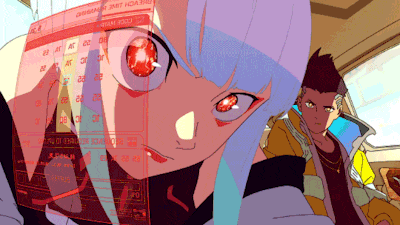

  

#

Me chamo Lucas, profissional de Suporte TI em transição para Desenvolvimento de Software e estudante de Análise e Desenvolvimento de Sistemas na PUCPR. Sou apaixonado por tecnologia, compartilho minha jornada e projetos através do meu GitHub.
 
#

<h3 align="left">Connect with me!</h3>

<h3 align="left">My Stack ~</h3>

 
 

<h3 align="left">GitHub Stats</h3>

  

<picture align="center">
  <source media="(prefers-color-scheme: dark)" srcset="https://raw.githubusercontent.com/lcsilvadev/lcsilvadev/output/github-contribution-grid-snake-dark.svg">
  <source media="(prefers-color-scheme: light)" srcset="https://raw.githubusercontent.com/lcsilvadev/lcsilvadev/output/github-contribution-grid-snake-dark.svg">
  
</picture>
